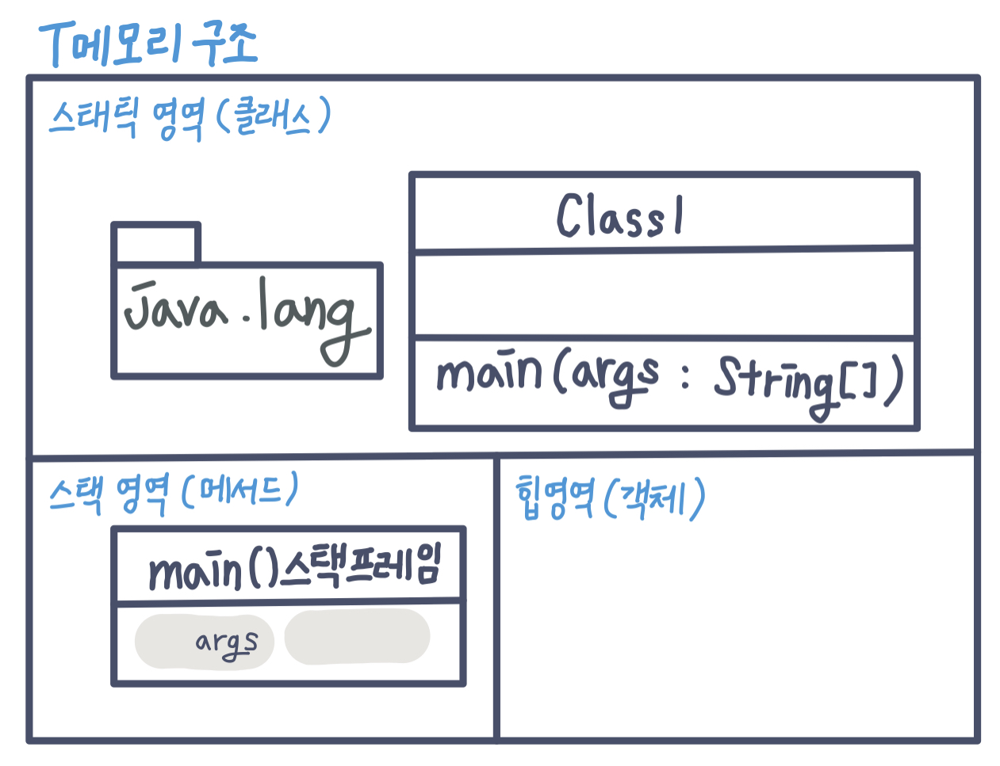
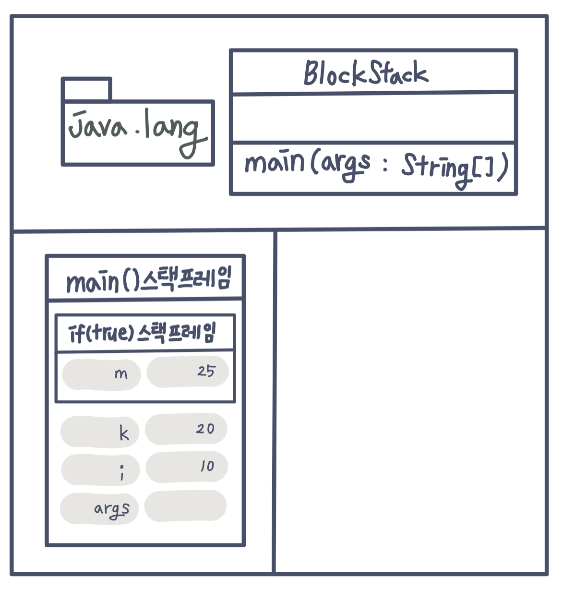
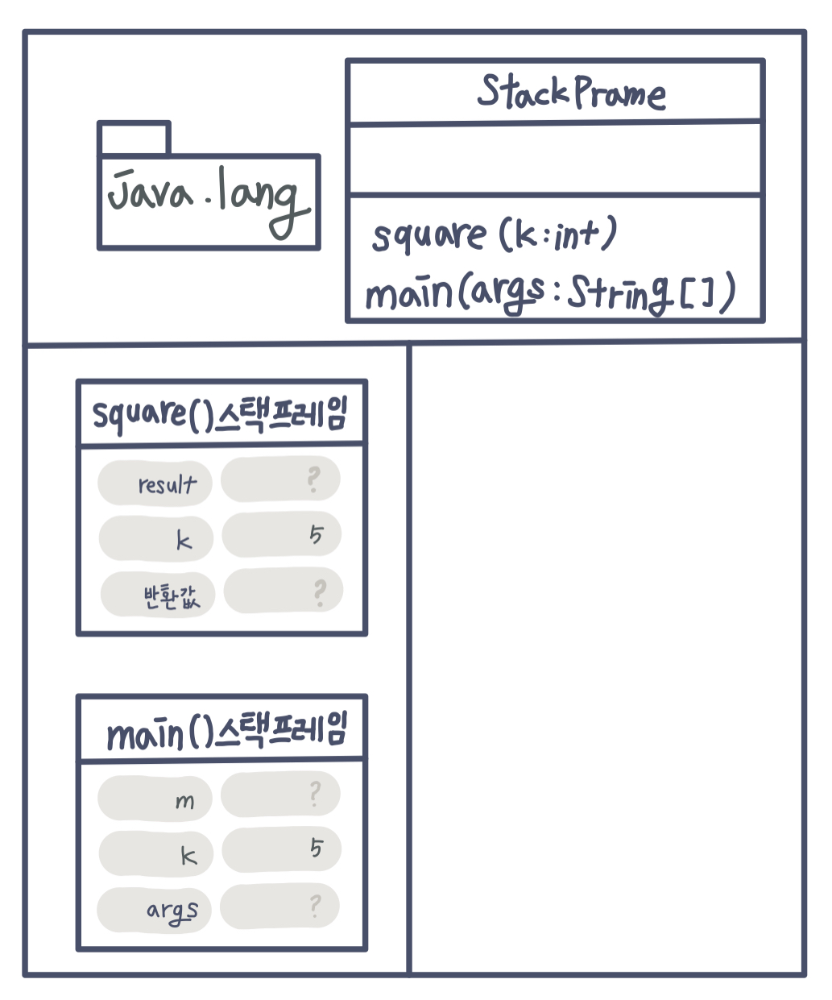
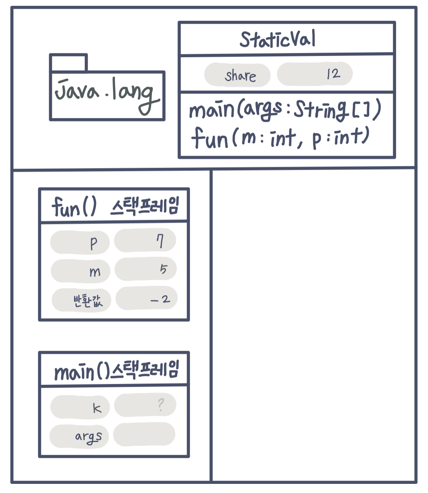
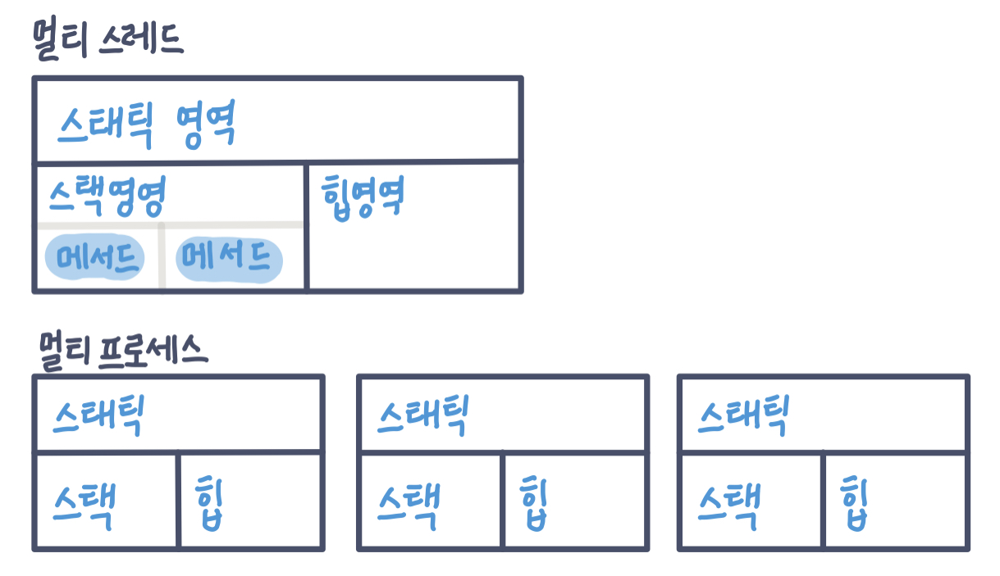

--- 
title: "스프링을 위한 자바 객체지향 CH2" 
excerpt: "" 
last_modified_at: 
categories:
 - OOP 
tags:

 ---
# **2.자바와 절차적/구조적프로그래밍**  

### **자바 프로그램의 개발과 구동**  
|현실세계|자바세계||  
|------|------|----|  
|소프트웨어 개발 도구|JDK|JVM용 소프트웨어 개발 도구|  
|운영체제|JRE|JVM용 OS|  
|하드웨어(컴퓨터)|JVM|가상의 컴퓨터|  

-JDK : Java Development Kit (자바 개발 도구)  
-JRE : Java Runtime Environment(자바 실행 환경)  
-JVM : Java Virtual Machin(자바 가상 기계)  

기존 C언어는 OS마다 배포설치파일을 따로 준비 해야했다면, 자바는 JRE가 대신 포함한다.  

------------------------  

### **자바에 존재하는 절차적/구조적 프로그래밍의 유산**  

객체 지향 프로그래밍은 절차적/구조적 프로그래밍의 어깨를 딛고 있다. 따라서 객체 지향 언어를 이해 하는 데 절차적/구조적 프로그래밍을 아는 것은 큰 도움이 된다.  

**구조적프로그래밍(=함수사용,goto자제)의 목적**  
-중복코드관리용이  
-논리를 함수 단위로 분할(이해하기 쉬운코드작성)  
-전역변수보다 지역변수 권장  

**함수와 메서드의 차이점**  
같은 기능을 하지만 함수는 클래스나 객체와 아무 관계가 없다. 반면 메서드는 반드시 클래스 정의 안에 존재해야 한다.

-> 객체 지향을 이해하기 위해 절차적/구조적 프로그래밍 즉, goto문 사용하지 않고 함수를 사용하는 프로그래밍을 먼저 이해하자.  

--------------------  

### **다시보는 main()메서드: 메서드 스택 프레임**  
다음과 같은 main()메서드가 실행될 때 메모리 상태는 그림과 같다. 

~~~java  
public class Tmemory{
    public static void main(String[] args){
        System.out.pringln("Hello OPP");
    }
}
~~~
  

**메서드 실행되기까지의 과정**  
\> JRE는 프로그램이 실행된느 시작점인 main()메서드가 있는지 확인  
\> main()메서드 확인되면 사전 준비 착수(JVM에 전원을 넣어 부팅)  
\> 부팅된 JVM은 목적 파일(소스코드)을 받아 실행  
\> (전처리과정:JVM이 맨 먼저 하는 일) 모든 자바 프로그램이 반드시 포함하게 되는 패키지인 java.lang을 T메모리 스태틱 영역에 가져다 놓음  
\> JVM은 개발자가 작성한 모든 클래스와 임포트 패키지 역시 스태틱 영역에 가져다 놓음  
\> 중괄호 만날때마다 스택 프레임이 하나씩 생김  
\> 메서드의 인자 args를 저장할 변수 공간을 스택 프레임 맨 밑에 확보  
\> 닫는 중괄호 만나면 스택 프레임 소멸  
\> main()메서드가 끝나면 JRE는 JVM을 종료하고 JRE자체도 운영체제 상의 메모리에서 사라짐  

--------------  

### **블록 구문과 메모리: 블록 스택 프레임**  
~~~java  
public class BlockStack{
    public static void main(String[] args){
        int i = 10;
        int k = 20;

        if(i==10){
            int m = k+5;
            k = m;
        }else{
            int p = k+10;
            k = p;
        }

        //k = m+p;
    }
}  
~~~
  
다음 그림은 7번째 줄을 실행한 후 T 메모리이다.  
6번째 줄 실행 후 i  변수에 저장된 값이 10인지 참이면 if ~ else 블록 중 위의 블록이 실행된다. 그리고 여는 중괄호를 만다면 스택 프레임이 시작된다고 했는데 **여기서 만들어지는 스택 프레임은 메서드 스택 프레임이 아니라 if 문, 그것도 참인 블록의 스택 프레임이다.**  

-> 14번째 줄 주석을 해제하면 아래와 긑은 컴파일러 오류가 발생한다.
> m cannot be resolved to a variable  
> c cannot be resolved to a variable  

그 이유는 지역 변수는 스택 프레임 안에서 벗어나지 못하기 때문이다. 따라서 스택 프레임이 사라지면 함께 사라진다.  

-------------------

### **지역 변수와 메모리: 스택 프레임에 갇혔어요!**  
변수는 T메모리 중 어디있을까?  
스태틱 영역, 스택 영역, 힙 영역  '세 군데 모두'다.  
- 지역변수 : 스택 영역, 스택 프레임 안에서 일생을 보낸다.  
- 글래스 멤버 변수 : 스태틱 영역, 스태틱 영역에 한번 자리 잡으면 JVM이 종료될 때까지 고정된 상태로 그 자리르 지킨다.  
- 객체 멤버 변수 : 힙 영역, 객체와 함께 가비지 컬렉터라고 하는 힙 메모리 회수기에 의해 일생을 마치게 된다.  
따라서 위의 코드에서 if 스택 프레임 안의 변수를 외부에서 접근하지 못하였다.  
반면, 내부 스택 프레임에서 외부 스택 프레임의 변수에 접근하는 것은 가능하다.  

------------
 
### **메서드 호출과 메모리: 메서드 스택 프레임2**  
다음은 메서드 호출 과정에서의 T메모리 구조이다.
~~~java  
public class StackPrame{
    public static void main(String[] args){
        int k = 5;
        int m;

        m = square(k);
    }

    private static int square(int k){
        int result;

        k = 25;

        result = k;

        return result;
    }
}
~~~  
  
square()메서드 스택 프레임에는 반환값을 저장할 변수 공간이 맨 아래, 그 다음으로 인자를 저장할 변수 공간, 마지막으로 메서드의 지역 변수가 자리 잡는다.  
**main()메서드의 k와 square()메서드의 k는 이름만 같지 서로 별도의 변수 공간이다.** -> Call By Value  
17 line 닫는 중괄호 만나면 반환 값을 돌려주면서 스택에서 사라진다.

\* 메서드를 블랙박스화 : 입력 값들과 반환 값들에 의해서만 메서드 사이에서 값이 전달될 뿐 서로 내부의 지역 변수를 볼 수 없다.  

\* sqare()메서드 실행 명령문에서 main()메서드의 지역 변수 참조할 수 없는 이유  

- 메서드는 서로의 고유 공간인데 무단 침입하면 문제를 유발할 수 있기 때문  
- 포인터 문제 : square()메서드에서 main()메서드 내부의 지역변수에 접근하려면 위치를 명확히 알아야한다. 즉, 포인터인 메모리 주소 값을 이해해야 하는데 자바가 환영받은 이유 중 하나가 포인터가 없다는 것이다.  
- 메서드는 다양한 곳으로부터 호출된다. 호춫ㄹ하는 메서드 내부의 지역 변수를 호출당하는 쪽에서 제어할 수 있게 만들려면 포인터를 주고받아야 한다.  
 
 \* 메서드 사이에 값을 전달하거나 반환하는 방법은 메서드의 인자와 반환값으로만 가능하다. 전역 변수도 있지만 가급적 쓰지 않는 것이 좋다.  

--------------

### **전역 변수와 메모리: 전역 변수 쓰지 말라니까요!**  
~~~java
public class StaticVal{
    static int share;

    public static void main(String[] args){
        share = 55;

        int k = fun(5,7);

        System.out.println(share);
    }

    private static int fun(int m, int p){
        share = m+p;

        return m-p;
    }
}
~~~
  

\* 스택 프레임에 종속적인 지역 변수  
\* 스택 프레임에 독립적인 지역 변수  
! 여러 메서드에서 전역 변수의 값을 변경하기 시작하면 전역 변수에 저장된 값을 파악하기 쉽지 않기 때문에 읽기 전용으로 값을 공유해서 전역 상수로 쓰는 것 외에는  피하는 게  좋다.  

------------  

### **멀티 스레드 / 멀티 프로세스의 이해**  
  
- 멀티 스레드 : 스택 영역을 스레드 개수만큼 분할해서 사용  
-다른 스레드의 스택 영역에 접근할 수 없지만 스태틱 영역과 힙 영역은 공유해서 사용  
-웹 프로그래밍에서 열심히 쓰임  
- 멀티 프로세스 : 다수의 T메모리 구조  
-프로세스마다 각자 고유의 공간이므로 서로 참조 불가
-다른 프로세스 메모리 절대 침범할 수 업슨ㄴ 메모리 안전한 구조  
-메모리 사용량이 큼  

--------

### **정리**  
- 객체 지향이 발전하면서 절차적/구조적 프로그램이이 좋지 않은 방식이라 하지만 객체 지향은 절차적/구조적 프로그래밍의 유산을 간직하고 있다.(연산자, 제어문, 메모리 관리체계 등등..)
- 사실 C++도 C언어 부정한 것이 아니라 계승한 것이다.  
- 따라서 프로그래머는 절차적/구조적 프로그래밍 기법도 잘 알고 있어야 한다.  
- 구조적 프로그래밍의 특징은 함수인데 객체 지향 프로그래머도 메서드 작성에 대한 지혜를 구조적 프로그래밍에서 배워 와야 한다.  
- 메서드를 만들 때 순서도나 의사코드를 작성하는 것이 좋다.(NS 다이어그램도 좋은 방법)  

