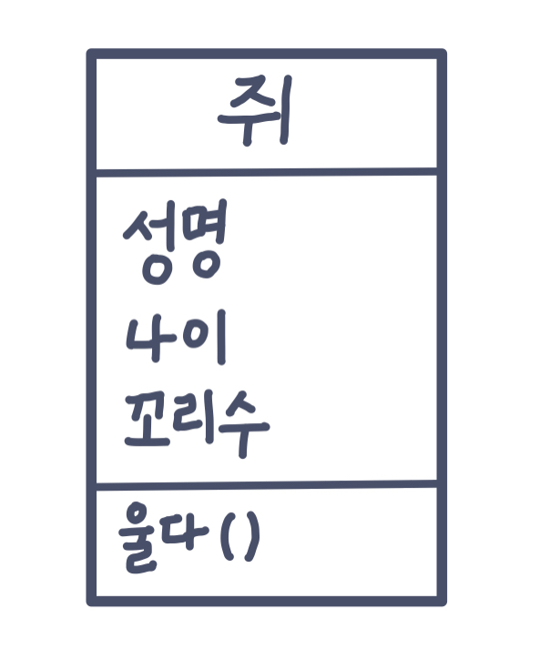
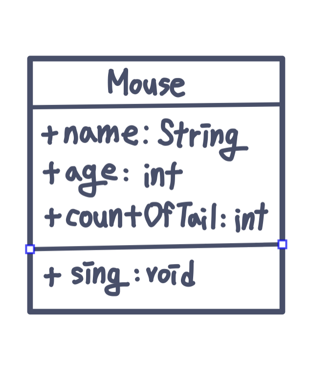
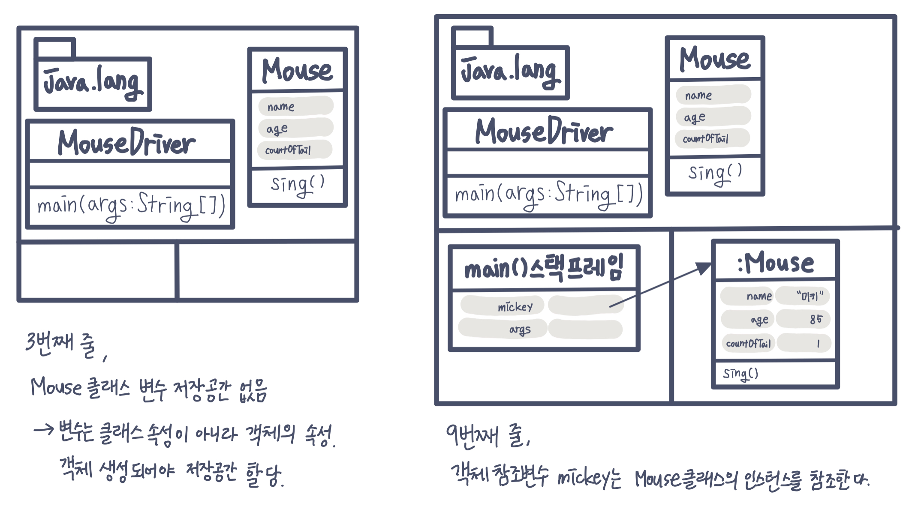
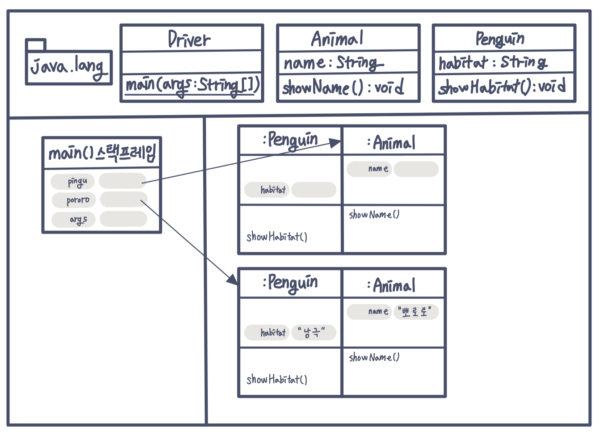

# 3장. 자바와 객체지향  
### **객체 지향은 인간 지향이다**  
- 어셈블리어 > c > c++ > java 로 언어가 로우레벨에서 하이레벨로 발전한 것은 인간을 배려하기 위한 과정이다.  
- 절차적/구조적 프로그래밍은 특히 포인터가 인간이 이해하기 힘든 부분이다.  
- 인간이 쉽게 개발할 수 있도록 **기계 종속적 개발에서 벗어나 현실세계 처럼 프로그래밍하자**라는 생각에서 객체지향이 시작된다.  
- 함수는 코드를 논리적인 단위로 구분하고 분할해서 정복하기 위함으로 만들어 졌다면,  
- 객체지향은 우리가 주변에서 사물을 인지하는 방식대로 프로그래밍하자는 것에서 출발한다.  
- 사물은 1.객체이며 2.고유하고 3.속성을 가지고 4.행위를 한다.  
- 인간의 인지법은 사물을 분류(class)해서 이해한다.  
- 객체지향 이전에는 속성과 메서드를 객체 단위로 묶지 않고 속성, 메서드 따로 분리했다.  
- 객체 지향에서는 우리가 주변에서 실제 사물을 인지 및 사고하는 방식대로 객체 단위의 프로그래밍이 가능하다.  

------------  

### **객체 지향의 4대 특성 - 캡! 상추다**  
캡 - 캡슐화(Encapsulation): 정보 은닉(information hiding)  
상 - 상속(Inheritance): 재사용  
추 - 추상화(Abstraction): 모델링  
다 - 다형성(Polymorphism): 사용 편의  

---------------  

### **추상화: 모델링**  
**추상** : 여러 가지 사물이나 개념에서 **공통되는 특성**이나 속성 따위를 **추출**하여 파악하는 작용.  
**추상화** : 구체적인 것을 분해해서 관찰자가 <u>관심 있는 특성</u>(애플리케이션 경계, 컨텍스트)만 가지고 재조합하는 것.(=모델링)  
**객체** : 세상에 존재하는 유일무이한 사물(속성과 기능 가짐)  
**클래스** : 분류, 집합. 같은 속성과 기능을 가진 객체를 총칭하는 개념  
**모델** : 목적에 맞게 관심 있는 특성만을 추출해서 표현. 추상화를 통해 실제 사물을 단순하게 묘사하는 것. (ex. 지구본, 태양계 모델)  
> OOP의 추상화는 모델링이다.  
> 클래스 설계에서 추상화가 사용된다.  
> 클래스 설계를 위해서는 애플리케이션 경계부터 정해야 한다.  
> 객체 지향에서 추상화의 결과는 클래스다.  
> java는  class키워드로 객체 지향의 추상화를 지원하고 있다.  

**추상화 과정**  
1. 애플리케이션 경계 설정  
쥐 캐릭터 관리 프로그램 개발  
2. 공통 특성 뽑아내기  

|객체명|미키마우스|제리|  
|----|--------|---|  
|속성들|성명:미키마우스   국적:미국   나이:87   종교:무교   신장:70cm   체중:11.5kg   애완동물:플루토   여자친구:미니마우스   꼬리:1개   ...|성명:제리   국적:미국   나이:75   종교:기독교   친구:톰   여자친구:null   꼬리:1개   ...|  
|행위들|달리다()   먹다()   휘파람불다()   데이트하다()   울다()   ...|달리다()   먹다()   장난치다()   ...|  

3. 관심 있는 특성 뽑아내기
:추상화의 결과물은 모델이다. 모델은 java에서 클래스로 표현된다.  

  

4. 논리적 설계를 물리적 설계로 바꾸기  

  

5. 코드로 변환  
~~~java  
package abstraction01;

public class Mouse{
    public String name;
    public int age;
    public int countOfTail;

    public void sing(){
        System.out/pringln(name+"찍찍")
    }
}
~~~  

6. 테스트  
~~~java
package abstraction01;

public class MouseDriver{
    public static void main(String[] args){
        Mouse mickey = new Mouse();
        mickey.name = "미키";
        mickey.age = 85;
        mickey.ountOfTail = 1;

        mickey.sing();

        mickey = null;

        Mouse jerry = new Mouse();
        jerry.name = "제리";
        jerry.age = 73;
        jerry.ountOfTail = 1;

        jerry.sing();
    }
}
~~~  

-스태틱영역 : 스태팅은 "고정된"이라는 의미로 스태틱 영역에 올라간 정보는 main() 메서드가 시작되기 전에 올라가서 main() 메서드가 종료된 후에 내려올 정도로 단단히 고정돼 있다.  
-스택 영역 : 스택 자료구조로 메서드들이 입출되는 여역이다.  
-힙영역 : 여러 객체등의 대용량 자료를 저장하는 영역이다.  

**클래스멤버/객체멤버, static멤버/인스턴스멤버**  
- 클래스의 모든 객체가 하나의 속성에 모두 같은 값을 가지고 있다면 해당 속성 변수에 static을 붙여서 클래스 멤버 속성으로 만드는 것이 효율적이다. 접근은 '클래스.클래스멤버변수'로 할 수 있다.   
- 메서드 또한 static을 붙이면 클래스(정적) 멤버 메서드로 쓸 수 있다.  
- 정적 메서드는 객체들의 존재 여부에 관계없이 쓸 수 있는 메서드다.(ex. main()메서드)  
- 정적 멤버들은 객체가 아닌 클래스에 속해 있다.
- UML 표기법에서 정적 멤버는 밑줄을 사용해 표시한다.  
- 정적 속성은 클래스가 학당될 때 메모리 공간이 확보 된다.(객체 속성은 객체가 생성될때 할당)  
- 지역 변수와 달리 클래스 속성과 객체 속성은 별도로 초기화 해주지 않아도 정수형은 0, 부동소수점형은 0.0, 논리형은 false, 객체는 null로 초기화 된다. 

<클래스멤버(정적멤버) vs 객체멤버>

|클래스 멤버|객체멤버|  
|--------|-------|  
|static||  
|- 클래스멤버속성 - 클레스 멤버 메서드|- 객체 멤버 속성 - 객체 멤버 메서드|  

<변수 유형>
|이름|다른 이름|사는 곳|
|---|-------|-----|  
|static 변수|클래스[멤버]속성, 정적 변수, 정적 속성, ...|스태틱 영역|  
|인스턴스 변수|객체[멤버]속성, 객체 변수, ...|힙 영역|  
|local 변수|지역 변수|스택영역|  

-----------------   

### **상속: 재사용+확장**  
객체 지향에서의 상속은 상위 클래스의 특성을 하위 클래스에서 상속 **(특성 상속)** 하고 거기에 더해 필요한 **특성을 추가**, 즉 확장해서 사용할 수 있다는 의미다.  
상위 클래스 쪽으로 갈수록 추상화, 일반화  
하위 클래스 쪽으로 갈수록 구체화, 특수화  
하위 클래스는 상위 클래스다. (고래는 포유류다.)  
하위 클래스 is a kind of 상위 클래스 (펭귄 is a kind of 조류)

- 상속의 강력함  
-상위클래스에서만 한번 정의하면 모든 하위 클래스들이 사용할 수 있다.  
-상위클래스 타입 변수에 하위 클래스 타입 객체를 초기화 할 수 있다.  

- 상속과 인터페이스  
-인터페이스 : 구현 클래스 is able to 인터페이스 (구현 클래스는 인터페이스할 수 있다 / 고래는 헤엄 칠 수 있다)  

- 상속과 메모리  
~~~java
package ingeritance;

public class Animal {
    public String name;

    public void showName(){
        System.out.println("안녕 나는 %s야. 반가워\n",name);
    }
}
~~~   
~~~java
package inheritance;

public class Penguin extends Animal{
    public String habitat;

    public void showHabitat(){
        System.out.println("%s는 %s에 살아 \n",name, habitat);
    }
}
~~~
~~~java
package inheritance;

public class Driverp{
    public static void main(Stirng[] args){
        Penguin pororo = new Penguin();

        pororo.name = "뽀로로";
        pororo.habitat = "남극";

        pororo.showName();
        pororo.showHabitat();

        Animal pingu = new Penguin();

        pingu.name = "핑구";
        //pingu.habitat = "EBS";

        pingu.showName();
        //pingu.showHabitat();

        //Penguin happyfeet = new Animal();
    }
}
~~~
13번째 줄 

- Penquin 클래스의 인스턴스만 힙 영역이 생긴 게 아니라 Animal 클래스의 인스턴스도 함께 힙 영역에 생긴다.  
\> 하위 클래스의 인스턴스가 생성될 때 상위 클래스의 인스턴스도 함께 생성된다. (모든 클래스의 최상의 클래스, Object클래스의 인스턴스도 함께 생성)  
- pingu 객체 참조 변수는 사실 펭귄이면서 자신이 펭귄이라는 사실은 모르고 동물이라는 것만 인식하고 있다.  
\> 펭귄 서식지 속성과 메서드를 사용할 수 없다.  
\> 명시적 형변환 연산(Casting), 암묵적 형변환(Promotion)  

### **다형성: 사용편의성**  
- 오버라이딩 : 같은 메서드 이름, 같은 인자 목록으로 상위 클래스의 메서드를 재정의 (ride : 올라타다)  
- 오버로딩 : 같은 메서드 이름, 다른 인자 목록으로 다수의 메서드를 중복 정의 (load : 적재하다)  

! 상위 클래스 타입의 객체 참조 변수를 사용하더라도 하위 클래스에서 오버라이딩한 메서드가 호출된다.   

### **캡슐화: 정보은닉**  
- private : 해당 클래스에서만 접근 가능 (해당 객체의 public 메소드를 통해서만 접근)  
- default : 해당 패키지에서만 접근 가능  
- protected : 동일 패키지의 클래스, 해당 클래스를 상속받은 외부 패키지의 클래스에서 접근 가능  
- public : 어떤 클래스에서라도 접근 가능  

\* 상속을 받지 않았다면 객체 멤버는 객체를 생성한 후 객체 참조 변수를 이요해 접근해야 한다.  
\* 정적 멤버는 **클래스명.정적멤버** 형식으로 접근하는 것을 권장한다.  

<정적 멤버의 접근 방법>  

||ClassA|같은 패키지|다른 패키지|  
|-|----|--------|---------|  
|ClassA.pubSt|O|상속 : O no상속 : O|상속 : O no상속 : O|  
|pubSt|O|상속 : O no상속 : X|상속 : O no상속 : X|  
|this.pubSt|O|상속 : O no상속 : X|상속 : O no상속 : X|  

------------  

### **참조 변수의 복사**  
기본 자료형은 CallByValue형색으로 값만 **복사.**  
객체 참조 변수는 주소를 **복사.**  
\> 기본 자료형 변수는 저장하고 있는 값을 그 값 자체로 해석,  
객체 참조 변수는 저장하고 있는 값을 주소로 해석  
"결국은 변수가 가진 값이 그대로 복사된다"

-------  
참고자료 : 김종민 저서 "스프링 입문을 위한 자바 객체 지향의 원리와 이해"
